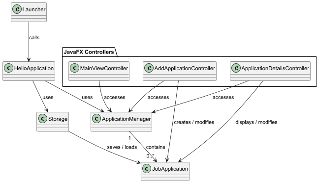
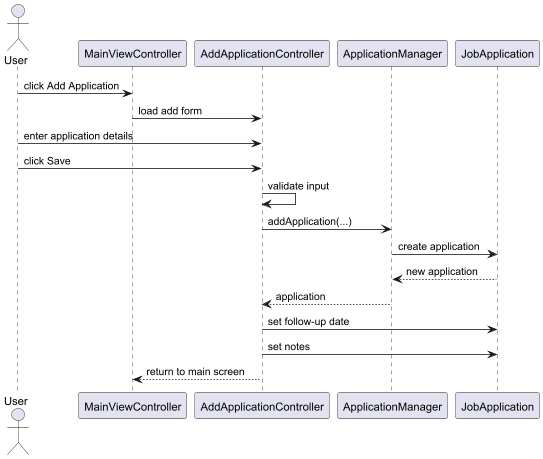
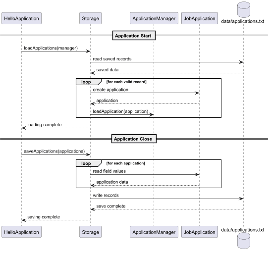

# ApplyTrack Developer Guide

## 1. Introduction

ApplyTrack is a JavaFX desktop application for managing submitted job applications.

This Developer Guide describes the main design of the application, the responsibilities of its major components, important implementation decisions, the testing approach and the software engineering process used during development.

The application is implemented in Java 25 using JavaFX 25 and Gradle.

## 2. Architecture Overview

ApplyTrack uses a simple layered structure that separates the application data model, application-management logic, user interface and persistence responsibilities.

The main components are:

- **Model** — represents individual job applications and related enums.
- **ApplicationManager** — manages the collection of job applications, generated IDs and filter state.
- **JavaFX controllers and FXML views** — provide the graphical user interface and handle user interaction.
- **Storage** — saves and loads job application data from a local text file.
- **HelloApplication** — starts the JavaFX application, loads persisted data and saves data when the application closes.
- **Launcher** — provides the entry point used by the packaged release JAR.

The general flow of data is:

```text
User
  ↓
JavaFX View / Controller
  ↓
ApplicationManager
  ↓
JobApplication Model

ApplicationManager
  ↕
Storage
  ↕
data/applications.txt
```

The JavaFX controllers obtain the shared `ApplicationManager` from the application class. Changes made through the interface modify the `JobApplication` objects managed by `ApplicationManager`.

When ApplyTrack starts, `Storage` loads previously saved applications into the manager. When the application closes normally, the manager's current application list is written back to storage.

### 2.1 Architecture Class Diagram

The following diagram shows the main classes and relationships in ApplyTrack.



The diagram shows the main application entry points, the JavaFX controllers, the application manager, the storage component and the job application model.

## 3. Main Components

### 3.1 JobApplication Model

`JobApplication` represents a single submitted job application.

Each instance stores:

- Application ID
- Company
- Position
- Job category
- Application date
- Source
- Application status
- Follow-up date
- Starred state
- Notes

The application ID is immutable once the object is created.

Required fields such as company, position, category, application date and source are validated before being stored. Optional fields such as follow-up date and notes may be left empty.

`JobApplication` also contains the logic for determining the follow-up status of an application based on a supplied date.

Related enums include:

- `ApplicationStatus`
- `JobCategory`
- `FollowUpStatus`

### 3.2 ApplicationManager

`ApplicationManager` manages the collection of `JobApplication` objects used by the application.

Its responsibilities include:

- Storing applications in memory
- Generating sequential application IDs
- Adding and removing applications
- Loading previously saved applications
- Maintaining the next available ID after loading
- Storing the currently selected filter settings

The manager also stores filter state for:

- Application status
- Job category
- Follow-up status
- Starred-only filtering

The selected filters are stored in the manager so that they can remain selected while the user navigates between different screens during the same session.

### 3.3 JavaFX Controllers and Views

ApplyTrack uses FXML files to define its user interface and JavaFX controller classes to handle user interaction.

The main views are:

- `main-view.fxml`
- `add-application-view.fxml`
- `application-details-view.fxml`

The corresponding controllers are responsible for displaying application data and reacting to user actions.

`MainViewController` displays the application list and manages filtering.

`AddApplicationController` handles both adding new applications and editing existing applications. When editing, the selected application is passed into the controller and its current values are loaded into the form.

`ApplicationDetailsController` displays the complete details of one application and provides actions for editing, deleting and changing its starred state.

Navigation is performed by replacing the root node of the existing JavaFX `Scene`. This allows the same application window to be reused between screens.

### 3.4 Storage

`Storage` is responsible for saving and loading application data.

By default, application data is stored in:

```text
data/applications.txt
```

Each application is represented as a single record containing ten fields separated by the `|` delimiter.

Free-text fields such as company, position, source and notes are Base64 encoded before being written to the file. This prevents pipe characters and newline characters entered by the user from interfering with the delimiter-based storage format.

When loading data, malformed or invalid records are skipped instead of causing the whole application to fail.

The `Storage` class also supports a custom file path, which is used by automated tests so that temporary test files can be created without modifying the user's real application data.

### 3.5 Application Entry Point and Packaging

`HelloApplication` is the main JavaFX application class.

When the application starts, it:

1. Loads previously saved applications using `Storage`.
2. Loads the main FXML view.
3. Creates and displays the JavaFX window.

When the application closes normally, `HelloApplication.stop()` saves the current applications using `Storage`.

A separate `Launcher` class is used as the entry point for the packaged release JAR.

`Launcher` calls the existing `HelloApplication.main()` method. This avoids the JavaFX runtime issue encountered when the JavaFX `Application` subclass was used directly as the entry point of the fat JAR.

The Shadow Gradle plugin is used to generate:

```text
release/applytrack.jar
```

The generated JAR includes the required JavaFX dependencies for the platform on which it is built.

## 4. Key Design Decisions

### 4.1 Reusing the Add Form for Editing

The same FXML form and `AddApplicationController` are used for both adding and editing applications.

When the controller is opened for a new application, the form starts with empty fields and the status defaults to `APPLIED`.

When the controller is opened for editing, the selected `JobApplication` is passed into the controller using `setApplication(...)`. The existing values are then loaded into the form.

This design avoids duplicating a separate edit form that would contain almost the same fields and validation logic.

An alternative would have been to create a separate `edit-application-view.fxml` and controller. This may make each controller more specialised, but it would duplicate much of the UI and validation behaviour. Reusing the add form keeps the implementation smaller and reduces the risk of the two forms becoming inconsistent.

One issue with editing was the interaction between application date and follow-up date validation. If the application date was changed while the old follow-up date was still stored, the object could temporarily enter an invalid state.

The final update order temporarily clears the follow-up date, updates the application date and then applies the new follow-up date.

#### 4.1.1 Add Application Sequence

The following sequence diagram shows the main interactions involved when a user creates a new application.



The form input is validated by `AddApplicationController` before `ApplicationManager` creates the new `JobApplication`. Optional values such as follow-up date and notes are then applied before the application returns to the main screen.

### 4.2 Follow-up Status Calculation

Follow-up status is calculated dynamically instead of being stored permanently in each `JobApplication`.

The calculation compares the application's follow-up date against a supplied reference date and returns one of:

- `NONE`
- `OVERDUE`
- `DUE_TODAY`
- `UPCOMING`
- `FUTURE`

An upcoming follow-up is defined as a date within the next seven days.

This design was chosen because follow-up status changes over time even when the saved application data does not change. For example, an application that is `UPCOMING` today may become `OVERDUE` several days later.

Storing the calculated status permanently would therefore require additional logic to keep it synchronised with the current date.

The method accepts a `LocalDate` reference value instead of directly calling `LocalDate.now()` internally. This makes the behaviour easier to test because automated tests can provide fixed dates and verify boundary conditions deterministically.

### 4.3 Persistence Format

ApplyTrack uses a simple text-file persistence format instead of a database.

Each application is stored as one record containing ten fields separated by the `|` character.

A delimiter-based format was selected because the amount of data is small and the application does not require advanced querying or concurrent access.

However, raw user-entered text cannot safely be stored directly because fields such as notes may contain the same delimiter or newline characters.

To prevent these values from breaking the file structure, the free-text fields are Base64 encoded before being saved and decoded when loaded.

This approach keeps the overall storage implementation simple while allowing arbitrary text to be preserved.

An alternative would have been to use a structured format such as JSON. JSON would provide clearer field names and more natural support for escaped text, but it would introduce an additional serialization approach for a relatively small project. The custom format was therefore retained after improving it with encoding and malformed-record handling.

#### 4.3.1 Persistence Sequence

The following sequence diagram shows how application data is loaded when ApplyTrack starts and saved when the application closes normally.



During startup, `Storage` reads the saved records, reconstructs valid `JobApplication` objects and loads them into `ApplicationManager`.

During shutdown, `HelloApplication` passes the current applications to `Storage`, which converts the application data into records and writes them to `data/applications.txt`.

### 4.4 Scene Root Replacement for Navigation

ApplyTrack uses a single JavaFX `Stage` and `Scene` for navigation.

When the user moves between the main screen, application form and application details screen, the application loads the new FXML content and replaces the root node of the existing `Scene`.

For example, the navigation approach is conceptually:

```java
Parent root = fxmlLoader.load();
stage.getScene().setRoot(root);
```

An earlier approach created a new `Scene` whenever navigation occurred. This worked while the application window was at its normal size, but navigating while the window was maximized caused it to return to the fixed dimensions of the newly created scene.

Attempts to manually restore the maximized state after replacing the scene were unreliable.

Reusing the existing `Scene` preserves the current `Stage` dimensions and maximized state automatically.

This also keeps navigation within one application window instead of creating additional windows or repeatedly resetting the window configuration.

## 5. Testing Approach

ApplyTrack uses both automated and manual testing.

### 5.1 Automated Testing

Automated tests are written using JUnit 5 and can be run using Gradle:

```text
.\gradlew test
```

The automated test suite covers the main model, manager and persistence behaviour.

The `JobApplication` tests cover areas such as:

- Constructor behaviour
- Default values
- Required-field validation
- Setter validation
- Optional fields
- Application and follow-up date constraints
- Follow-up status calculation

The `ApplicationManager` tests cover areas such as:

- Adding applications
- Sequential ID generation
- Removing applications
- Loading existing applications
- Maintaining the next available ID after loading
- Filter state

The `Storage` tests use temporary directories and files so that testing does not modify the real `data/applications.txt` file.

Storage tests cover cases such as:

- Saving and loading one application
- Saving and loading multiple applications
- Preserving status, follow-up date, starred state and notes
- Preserving text containing delimiter characters and multiple lines
- Missing save files
- Empty save files
- Malformed records
- Invalid saved values
- Continuing the ID sequence after loading

Fixed `LocalDate` values are used when testing follow-up behaviour so that the tests do not depend on the actual date on which they are run.

### 5.2 Manual Testing

Manual testing was used for JavaFX behaviour and end-to-end workflows that were not directly covered by the unit tests.

Examples include:

- Adding an application through the form
- Viewing application details
- Editing application fields
- Deleting an application using the confirmation dialog
- Starring and unstarring applications
- Combining different filters
- Navigating between screens
- Checking that window size and maximized state are preserved during navigation
- Closing and reopening the application to verify persistence
- Launching the packaged release JAR

The release JAR was tested using Java 25 on Windows.

A Linux-targeted JavaFX JAR was also generated and launched using OpenJDK 25 under Ubuntu in WSL2 with WSLg as an additional compatibility check.

macOS was not available for direct testing.

### 5.3 Regression Testing

The full Gradle test suite was rerun after major feature changes and bug fixes.

This was especially important after changes involving:

- Editing and date validation
- Follow-up tracking
- Java 25 and JavaFX 25 migration
- Persistence
- Navigation
- Release packaging

This helped confirm that new changes did not break previously working behaviour.

## 6. Software Engineering Process

ApplyTrack was developed incrementally using a feature-based Git workflow.

Development was divided into small features such as:

- Static start screen
- Job application model
- Add application form
- In-memory application list
- Edit application
- Application details and deletion
- Status and starring
- Filtering
- Follow-up tracking
- Java 25 and JavaFX 25 migration
- Persistence
- Release packaging

Each feature was developed on a separate Git branch and merged into `master` through a pull request after testing.

This approach made it easier to isolate changes, review the purpose of each commit and avoid introducing several unrelated changes at the same time.

### 6.1 Incremental Development

Features were implemented in small steps instead of attempting to build the entire application at once.

For example, the application model and validation were completed before the full UI workflow was added. Persistence was also postponed until the core add, edit, delete, status, filtering and follow-up features were already working.

This reduced the number of interacting problems that needed to be debugged at the same time.

### 6.2 Version Control

Git and GitHub were used throughout development.

The repository used:

- Feature branches
- Incremental commits
- Pull requests
- Merging into `master` after verification

Branch names were based on the feature being implemented, such as:

```text
feature/job-application-model
feature/add-application-form
feature/filter-applications
feature/persistence
feature/release-packaging
```

This provided a clear development history and made it easier to identify which changes introduced each feature.

### 6.3 Verification Before Integration

Before merging major features, I used a combination of:

- Automated JUnit tests
- Manual UI testing
- Gradle builds
- Source review

When a change introduced unexpected behaviour, I investigated and corrected it before continuing with later work.

Examples included the date-update issue during editing, delimiter problems in persistence, window resizing during navigation and JavaFX release packaging problems.

### 6.4 Documentation and Development Logs

Development logs were maintained under the `logs` directory to summarise the main AI-assisted development sessions.

The logs record:

- The objective of each development session
- How AI was used
- Decisions made during implementation
- Issues encountered
- Verification performed
- The final outcome

These logs were later used as supporting material when writing the project reflections.

## 7. AI-Assisted Development

AI was used throughout ApplyTrack development for planning, explanation, implementation guidance, debugging and code review.

The development process generally followed an iterative pattern:

1. Identify the next feature or problem.
2. Ask the AI for guidance or to review the current approach.
3. Implement or adapt the suggested change.
4. Run automated tests or manually test the behaviour.
5. Provide errors or unexpected behaviour back to the AI when further investigation was needed.
6. Continue only after the change was understood and verified.

AI assistance was especially useful for areas such as:

- JavaFX controller and navigation logic
- Model validation
- Follow-up date handling
- Persistence design
- Automated test design
- Java 25 and JavaFX 25 migration
- Release packaging and troubleshooting

The AI was not treated as a guarantee of correctness. Several suggestions required additional testing or modification before they worked correctly in the final application.

Examples include the edit-date validation issue, the delimiter collision in the persistence format and the multi-stage troubleshooting required to produce the runnable JavaFX release JAR.

More detailed discussion of the prompts, responses, verification and lessons learned is provided in `docs/Reflections.md`.

Summaries of the main AI-assisted development sessions are recorded under the `logs` directory.

## 8. Acknowledgements

ApplyTrack was developed using the following tools, libraries and resources:

- **Java 25** — programming language and runtime.
- **JavaFX 25 / OpenJFX** — desktop user interface framework.
- **Gradle** — build automation and dependency management.
- **JUnit 5** — automated unit testing.
- **Shadow Gradle Plugin** — creation of the packaged release JAR containing project dependencies.
- **PlantUML** — creation of UML diagrams used in this Developer Guide.
- **IntelliJ IDEA** — development environment.
- **Git and GitHub** — version control and pull-request workflow.

AI assistance from ChatGPT was used throughout the project for planning, explanation, implementation guidance, debugging, testing suggestions, code review and documentation support. The AI-assisted development process and selected interactions are documented in `docs/Reflections.md` and the `logs` directory.
